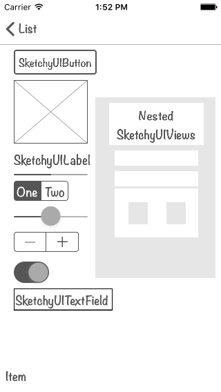

# SketchyKit

SketchyKit provides a set of GUI components that work just like Apple's stock
components, but have a different look that makes them stand apart. This can help
demonstrate to users that they are looking at an unfinished design.

| a sketchy tableview | various sketchy components |
| --- | ---- |
|  |  |

SketchyKit is meant to be used temporarily while building your application, so
that you can quickly get functionality in place without giving anyone the
mistaken impression that your design is complete. Once you're ready to style
your components as you would normally, it's easy to do so.

## Installation

### [Carthage]

[Carthage]: https://github.com/Carthage/Carthage

Add the following to your Cartfile:

```
github "thoughtbot/SketchyKit"
```

Then run `carthage update`.

Follow the current instructions in [Carthage's README][carthage-installation]
for up to date installation instructions.

[carthage-installation]: https://github.com/Carthage/Carthage#adding-frameworks-to-an-application

## Create a workspace

After doing that basic Carthage setup, you'll need to take a couple of
additional steps. Xcode currently doesn't incorporate custom components into
Interface Builder if they're contained in an external framework, unless it has
access to the source code in some way (a problem which is described in some
detail [here][carthage_issue_335]). You don't want to add the source code to
your app project (since it already contains the framework), but you can work
around this problem by using a workspace.

To do this, just create a new workspace and save it in your project's directory,
drag your existing project into the top level of the workspace, and then do the
same for `Carthage/Checkouts/SketchyKit/SketchyKit.xcodeproj`. Make sure to
**uncheck** the "copy files" option when Xcode asks for details about adding
`SketchyKit.xcodeproj` to your workspace.

[carthage]: https://github.com/Carthage/Carthage
[carthage_issue_335]: https://github.com/Carthage/Carthage/issues/335

### [CocoaPods]

[CocoaPods]: http://cocoapods.org

Add the following to your [Podfile](http://guides.cocoapods.org/using/the-podfile.html):

```ruby
pod 'SketchyKit'
```

You will also need to make sure you're opting into using frameworks:

```ruby
use_frameworks!
```

Then run `pod install` with CocoaPods 0.36 or newer.

### Git Submodules

I guess you could do it this way if that's your thing.

Add this repo as a submodule, and add the project file to your workspace. You
can then link against `SketchyUIKit.framework` for your application target.

### Cowboy installation

If all of those procedures sound like too much work, you can always just clone
this repository and drag the source files into your project, but then you'll
lose all the benefits of using package management. Don't say I didn't warn you.

## Usage

SketchyKit provides drop-in replacements for several standard UIKit components
directly in Interface Builder:

- `UIButton`
- `UIImageView`
- `UILabel`
- `UINavigationBar`
- `UIProgressView`
- `UISegmentedControl`
- `UISlider`
- `UIStepper`
- `UISwitch`
- `UITableViewCell`
- `UITextField`
- `UIToolbar`

In SketchyKit, each of these classes has a corresponding subclass, named by
simply putting the prefix `Sketchy` in front of the original, e.g.
`SketchyUIButton`, `SketchyUIImageView`, etc.

Usage is simple. Drag any of these standard components from Xcode's *Object
Library* into your layout. Then use the *Identity Inspector* to prepend the word
`Sketchy` in front of the normal class name. In most cases, just writing `"sk"` in
the *Class* field is enough to let Xcode fill in the rest for you. Then just hit
`enter`, and your object will immediately look sketchy. You'll also see that the
*Module* field is automatically filled in with `SketchyUIKit`.

Later on, when you want to change it back to a normal UIKit component to do
proper styling, simply use the *Identity Inspector* again, this time removing
the custom class name.

While using sketchy components, you can resize them, reposition them, apply
constraints, etc, just as you normally would. When you change them back to
normal components later, all geometry and constraint data will remain the same.

Note: Due to the way Xcode sets things up in Interface Builder,
`SketchyUINavigationBar` won't get the sketchy look within the editor. When you
run in the simulator or on a device however, it will work just fine. 

## Background

When building iOS apps, we have at our disposal a great set of built-in GUI
components in UIKit. Depending on the project and the needs of the product
owner, some of these are perfect directly out of the box, but some might need
significant tweaking to make them match the desired design of the product. In
either case, starting off with standard UIKit components is often a good first
step, so that we can begin creating a working application that users can see and
touch even if the overall visual theme hasn't been completely decided.

Unfortunately, this subtlety is lost on some users. Some people, when exposed to
a partially-working app which has all the pizzazz and flashiness of Settings or
Mail, might think that our work-in-progress represents the complete product
vision, and may begin to complain about the design, or quietly doubt our skills.

This is where SketchyKit comes in. The idea is to provide a set of easy-to-use
components right in Xcode that look sufficiently *different* from the standard
UIKit controls that it should be really obvious to anyone that they're looking
at something that isn't "done".


## License

SketchyKit is Copyright (c) 2016 thoughtbot, inc. It is free software, and may
be redistributed under the terms specified in the [LICENSE] file.

[LICENSE]: /LICENSE

## About


SketchyKit is maintained and funded by thoughtbot, inc. The names and logos for
thoughtbot are trademarks of thoughtbot, inc.

We love open source software! See [our other projects][community] or look at
our product [case studies] and [hire us][hire] to help build your iOS app.

[community]: https://thoughtbot.com/community?utm_source=github
[case studies]: https://thoughtbot.com/ios?utm_source=github
[hire]: https://thoughtbot.com/hire-us?utm_source=github
